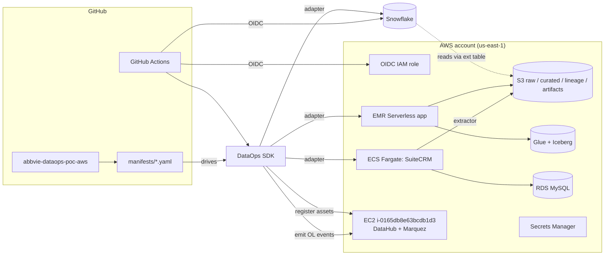

# AbbVie DataOps SDK PoC — AWS-only build

End-to-end proof-of-concept for the **manifest-driven AbbVie DataOps Governance
SDK**, exercised across **three CI/CD pipelines** (Snowflake, AWS EMR Serverless,
SuiteCRM as the OSS Salesforce analog), all routed through one **DataHub** catalog
and one **OpenLineage / Marquez** lineage backend running on EC2.

> **New here? Start with [`CUSTOMER_README.md`](CUSTOMER_README.md)** — a 1-page tour with the 5-minute walkthrough video, a self-guided 10-min sequence, and the FAQ. This `README.md` is the operator/contributor reference.

## What this PoC demonstrates

1. **One SDK, one manifest format**, three platforms — schema enforcement, DQ,
   constraints, tokenization, all consistent across Snowflake / EMR / SuiteCRM.
2. **GitHub Actions CI/CD** with **OIDC** to both AWS and Snowflake (no
   long-lived secrets), wired per the
   [Snowflake CLI OIDC](https://www.snowflake.com/en/developers/guides/configure-cicd-integrations-with-snowflake/)
   and [schemachange + GitHub](https://www.snowflake.com/en/developers/guides/devops-dcm-schemachange-github/) guides.
3. **OpenLineage** events emitted from every adapter — captured by Marquez,
   surfaced in DataHub.
4. **DataHub** catalog populated with datasets, owners, classification tags, and
   upstream lineage from each pipeline.
5. **Fail-closed PR gate** — a PR that adds a Snowflake column without updating
   the schema contract is blocked by `pr-governance.yml`.

## Architecture



## Repo layout

| Path | Purpose |
|---|---|
| `sdk/` | Python package `abbvie-dataops-governance-sdk` + `abbvie-dataops` CLI |
| `manifests/` | Per-service `dataops-manifest.yaml` + schemas / constraints / DQ suites / sensitivity policies |
| `migrations/snowflake/` | schemachange `V*.sql` + `R*.sql` |
| `pipelines/emr/` | PySpark transform job + OpenLineage Spark listener config |
| `apps/suitecrm/` | SuiteCRM container, MySQL migrations, REST extractor (lands Parquet to S3) |
| `apps/datahub/` | docker-compose + bootstrap for the DataHub + Marquez EC2 |
| `terraform/aws/` | OIDC role, S3, Glue, EMR Serverless, ECR, ECS, RDS, Secrets Manager, SG rules for DataHub EC2 |
| `terraform/snowflake/` | Snowflake account-level shell (database, schema, warehouse, deploy role) |
| `.github/workflows/` | `snowflake-deploy`, `emr-deploy`, `suitecrm-deploy`, `pr-governance`, `sdk-ci` |
| `customer/` | Customer-facing write-up + architecture diagrams |

## Walkthrough

- **5-minute walkthrough recording**: [Latest release](https://github.com/sfc-gh-palapaty/abbvie-dataops-sdk/releases/latest) · [direct download](https://github.com/sfc-gh-palapaty/abbvie-dataops-sdk/releases/latest/download/abbvie-dataops-sdk-walkthrough.mov) (96 MB MOV)
- **Canonical schema-drift demo PR**: [#2 — add WEBSITE column to ACCOUNTS](https://github.com/sfc-gh-palapaty/abbvie-dataops-sdk/pull/2) — shows the fail-closed gate (red), the contract-fix commit (green), and the downstream `snowflake-deploy` run end-to-end.
- **Architecture diagrams**: [`customer/POC_ARCHITECTURE.md`](customer/POC_ARCHITECTURE.md)

Live PoC endpoints:
- DataHub UI: `http://<DATAHUB_EC2_PUBLIC_IP>:9002` (credentials provisioned separately)
- Marquez UI: `http://<DATAHUB_EC2_PUBLIC_IP>:13000`
- GitHub Actions: `https://github.com/sfc-gh-palapaty/abbvie-dataops-sdk/actions`

## Quick start

```bash
# 0. AWS creds (STS credentials for your target account)
export AWS_REGION=us-east-1
export AWS_ACCESS_KEY_ID=...
export AWS_SECRET_ACCESS_KEY=...
export AWS_SESSION_TOKEN=...

# 1. Apply AWS infrastructure
cd terraform/aws
terraform init && terraform apply

# 2. Bring up DataHub + Marquez on EC2 i-0165db8e63bcdb1d3
ssh ubuntu@<ec2-public-ip>
sudo bash /opt/abbvie/datahub/bootstrap.sh   # see apps/datahub/README.md

# 3. Apply Snowflake account shell
cd ../snowflake
terraform init && terraform apply

# 4. Local SDK install + dry-run all manifests
cd ../../sdk
pip install -e '.[all]'
abbvie-dataops run --manifest ../manifests/snowflake-curated.yaml --profile develop

# 5. Push to GitHub (sfc-gh-palapaty/abbvie-dataops-poc-aws) and watch the workflows
```

## The "data change" gate (acceptance demo)

| Step | Expected behavior |
|---|---|
| Open PR adding `migrations/snowflake/V1.2.0__add_phone.sql` (no schema update) | `pr-governance.yml` runs, `must_fail_closed=true`, PR comment lists blocker, build fails |
| Push fix updating `manifests/schemas/snowflake/accounts.json` to add `phone` | `pr-governance.yml` re-runs, gate passes |
| Merge to `main` | `snowflake-deploy.yml` runs schemachange + SDK gate, evidence bundle uploaded, dataset re-registered in DataHub, OpenLineage event chain `suitecrm.public.accounts -> glue.curated.accounts -> snowflake.curated.accounts` visible in Marquez/DataHub UI |

## CI/CD reference

- **Snowflake**: `snowflakedb/snowflake-cli-action@v2` (OIDC) → `snow connection test -x` → `schemachange` → `abbvie-dataops run --profile promote`
- **EMR Serverless**: `aws-actions/configure-aws-credentials@v4` (OIDC) → upload PySpark + `openlineage-spark.jar` → `aws emr-serverless start-job-run` → `abbvie-dataops run --profile promote`
- **SuiteCRM**: AWS OIDC → ECR build/push → `python apps/suitecrm/migrations/runner.py` → `python apps/suitecrm/extractor/extract.py` → `abbvie-dataops run --profile promote`
- **PR gate**: `abbvie-dataops gate --changed-files changed.txt --strict` → run triggered manifests in `develop` profile → comment evidence on PR

## See also

- [Snowflake DCM with schemachange + GitHub](https://www.snowflake.com/en/developers/guides/devops-dcm-schemachange-github/)
- [Snowflake CI/CD OIDC](https://www.snowflake.com/en/developers/guides/configure-cicd-integrations-with-snowflake/)
- [OpenLineage spec](https://openlineage.io/)
- [DataHub OpenLineage source](https://datahubproject.io/docs/generated/ingestion/sources/openlineage/)
