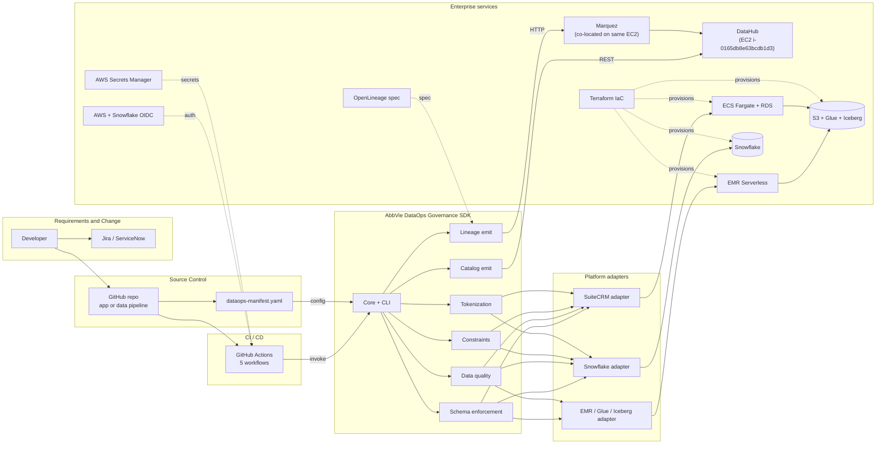
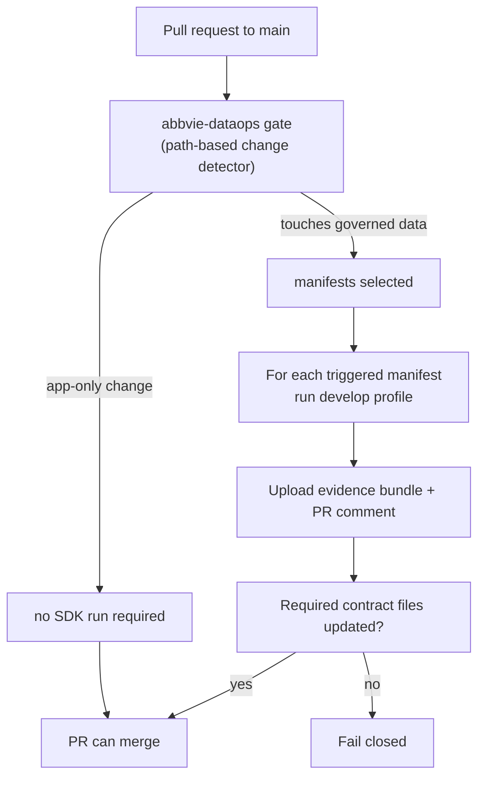
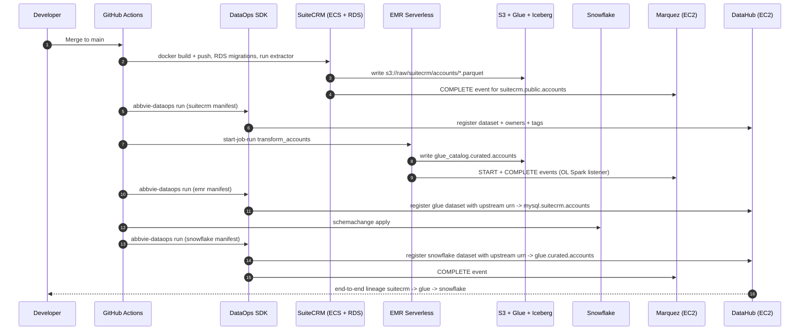

# AbbVie DataOps SDK — PoC architecture (AWS build)

Three Mermaid diagrams to drop into Confluence / Word. The PoC swaps Salesforce
for **SuiteCRM** (open-source CRM, Salesforce analog) and Alation for **DataHub**;
everything else mirrors the customer architecture in `ABBVIE_DATAOPS_SDK_WRITEUP_AND_TALK_TRACK.md`.

## Diagram 1 — End-to-end PoC architecture

## Diagram 2 — The data-change gate (PR governance)

## Diagram 3 — End-to-end lineage chain

